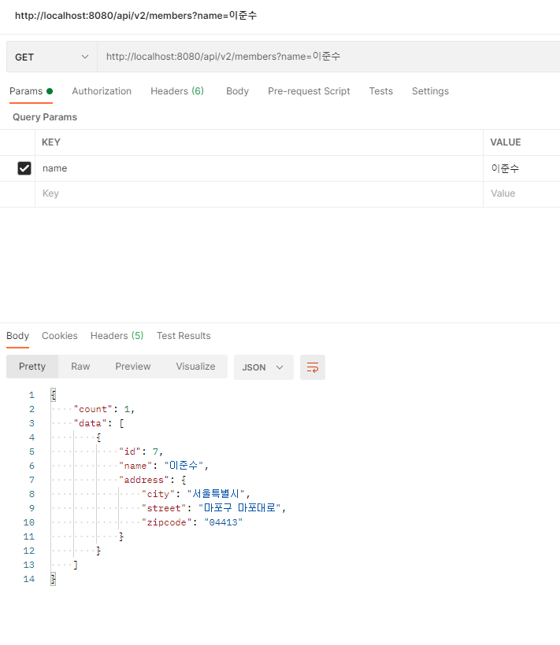

querydsl을 적용해보다가 java.lang.unsupportedoperationexception이라는 에러를 처음 접하게 되어 기록을 남기고자 한다.</br>
왜 이런 예외가 발생했는지 거슬러가보자.

### 1. 의존성 설정
```
<dependency>
    <groupId>com.querydsl</groupId>
    <artifactId>querydsl-jpa</artifactId>
    <version>4.2.1</version>
</dependency>
<dependency>
    <groupId>com.querydsl</groupId>
    <artifactId>querydsl-apt</artifactId>
    <version>4.2.1</version>
</dependency>
```
위와 같이 querydsl을 사용하기 위해 의존성 설정을 추가했다.

### 2. 메소드 작성
아래와 같이 이름을 조건으로 가지는 회원 조회 메소드를 만들었다.
```java
@RequiredArgsConstructor
@Repository
public class MemberQueryRepository {
    private final JPAQueryFactory jpaQueryFactory;

    public List<Member> findMembersByName(String name) {
        BooleanBuilder builder = new BooleanBuilder();

        if (!Objects.isNull(name)) {
            builder.and(member.name.eq(name));
        }

        return jpaQueryFactory.selectFrom(member)
                .where(builder)
                .fetch();
    }
}
```

### 3. Restful API 작성
아래와 같이 name이라는 변수를 파라미터로 하는 회원 정보를 조회하는 API를 작성하였다.</br>
파라미터의 경우, 필수 값은 아니며 BooleanBuilder를 사용해서 name 파라미터가 있는 경우, where 조건문이 동적으로 적용되도록 했다. 
```java
@GetMapping("/api/v2/members")
public Result<List<MemberDto>> getMembersV2(@RequestParam(required = false) String name) {
    List<Member> memberList = memberQueryRepository.findMembersByName(name);
    List<MemberDto> result = memberList.stream()
            .map(m -> new MemberDto(m.getId(), m.getName(), m.getAddress())).collect(Collectors.toList());
    return new Result<>(result.size(), result);
}
```

### 4. 대망의 Exception 발생
파라미터가 없는 경우, 정상적으로 조회가 됐다. 그런데 name 파라미터를 넣어주는 경우, 아래와 같은 문제가 발생했다...
```
java.lang.UnsupportedOperationException: null
	at java.util.Collections$UnmodifiableMap.put(Collections.java:1459) ~[na:1.8.0_252]
	at com.querydsl.jpa.JPQLSerializer.visitConstant(JPQLSerializer.java:327) ~[querydsl-jpa-4.2.1.jar:na]
	at com.querydsl.core.support.SerializerBase.visit(SerializerBase.java:221) ~[querydsl-core-4.4.0.jar:na]
	at com.querydsl.core.support.SerializerBase.visit(SerializerBase.java:36) ~[querydsl-core-4.4.0.jar:na]
	at com.querydsl.core.types.ConstantImpl.accept(ConstantImpl.java:140) ~[querydsl-core-4.4.0.jar:na]
	at com.querydsl.core.support.SerializerBase.handle(SerializerBase.java:122) ~[querydsl-core-4.4.0.jar:na]
	at com.querydsl.core.support.SerializerBase.visitOperation(SerializerBase.java:301) ~[querydsl-core-4.4.0.jar:na]
	at com.querydsl.jpa.JPQLSerializer.visitOperation(JPQLSerializer.java:437) ~[querydsl-jpa-4.2.1.jar:na]
	at com.querydsl.core.support.SerializerBase.visit(SerializerBase.java:262) ~[querydsl-core-4.4.0.jar:na]
	at com.querydsl.core.support.SerializerBase.visit(SerializerBase.java:36) ~[querydsl-core-4.4.0.jar:na]
	at com.querydsl.core.types.OperationImpl.accept(OperationImpl.java:83) ~[querydsl-core-4.4.0.jar:na]
	at com.querydsl.core.support.SerializerBase.handle(SerializerBase.java:122) ~[querydsl-core-4.4.0.jar:na]
	at com.querydsl.jpa.JPQLSerializer.serialize(JPQLSerializer.java:220) ~[querydsl-jpa-4.2.1.jar:na]
	at com.querydsl.jpa.JPAQueryBase.serialize(JPAQueryBase.java:60) ~[querydsl-jpa-4.2.1.jar:na]
	at com.querydsl.jpa.JPAQueryBase.serialize(JPAQueryBase.java:50) ~[querydsl-jpa-4.2.1.jar:na]
	at com.querydsl.jpa.impl.AbstractJPAQuery.createQuery(AbstractJPAQuery.java:98) ~[querydsl-jpa-4.2.1.jar:na]
	at com.querydsl.jpa.impl.AbstractJPAQuery.createQuery(AbstractJPAQuery.java:94) ~[querydsl-jpa-4.2.1.jar:na]
	at com.querydsl.jpa.impl.AbstractJPAQuery.fetch(AbstractJPAQuery.java:201) ~[querydsl-jpa-4.2.1.jar:na]
	at me.junsu.demojpastudy.repository.member.query.MemberQueryRepository.findMembersByName(MemberQueryRepository.java:26) ~[classes/:na]
	at me.junsu.demojpastudy.repository.member.query.MemberQueryRepository$$FastClassBySpringCGLIB$$5c27e0c4.invoke(<generated>) ~[classes/:na]
	at org.springframework.cglib.proxy.MethodProxy.invoke(MethodProxy.java:218) ~[spring-core-5.3.10.jar:5.3.10]
	at org.springframework.aop.framework.CglibAopProxy$CglibMethodInvocation.invokeJoinpoint(CglibAopProxy.java:779) ~[spring-aop-5.3.10.jar:5.3.10]
	at org.springframework.aop.framework.ReflectiveMethodInvocation.proceed(ReflectiveMethodInvocation.java:163) ~[spring-aop-5.3.10.jar:5.3.10]
	at org.springframework.aop.framework.CglibAopProxy$CglibMethodInvocation.proceed(CglibAopProxy.java:750) ~[spring-aop-5.3.10.jar:5.3.10]
	at org.springframework.dao.support.PersistenceExceptionTranslationInterceptor.invoke(PersistenceExceptionTranslationInterceptor.java:137) ~[spring-tx-5.3.10.jar:5.3.10]
	at org.springframework.aop.framework.ReflectiveMethodInvocation.proceed(ReflectiveMethodInvocation.java:186) ~[spring-aop-5.3.10.jar:5.3.10]
	at org.springframework.aop.framework.CglibAopProxy$CglibMethodInvocation.proceed(CglibAopProxy.java:750) ~[spring-aop-5.3.10.jar:5.3.10]
	at org.springframework.aop.framework.CglibAopProxy$DynamicAdvisedInterceptor.intercept(CglibAopProxy.java:692) ~[spring-aop-5.3.10.jar:5.3.10]
	at me.junsu.demojpastudy.repository.member.query.MemberQueryRepository$$EnhancerBySpringCGLIB$$a02bba44.findMembersByName(<generated>) ~[classes/:na]
	at me.junsu.demojpastudy.api.MemberApiController.getMembersV2(MemberApiController.java:58) ~[classes/:na]
	at sun.reflect.NativeMethodAccessorImpl.invoke0(Native Method) ~[na:1.8.0_252]
	at sun.reflect.NativeMethodAccessorImpl.invoke(NativeMethodAccessorImpl.java:62) ~[na:1.8.0_252]
	at sun.reflect.DelegatingMethodAccessorImpl.invoke(DelegatingMethodAccessorImpl.java:43) ~[na:1.8.0_252]
	at java.lang.reflect.Method.invoke(Method.java:498) ~[na:1.8.0_252]
    ....생략
```
찬찬히 로그를 봐보자..</br>
정확히 원인이 무엇인지는 모르겠지만 의심이 가는 부분을 발견했다.</br> 
__at com.querydsl.jpa.JPQLSerializer.visitConstant(JPQLSerializer.java:327) ~[querydsl-jpa-4.2.1.jar:na]__</br>
__at com.querydsl.core.support.SerializerBase.visit(SerializerBase.java:221) ~[querydsl-core-4.4.0.jar:na]__</br>
다만 로그에서 위 부분을 봤을 때, querydsl-core와 querydsl-jpa 버전이 다른 것으로 보아 버전 문제가 아닐까 생각했다.</br>

### 5. 변경사항
아래와 같이 버전을 4.4.0으로 수정한 후, 다시 확인해보았다.
```
<!-- Querydsl -->
<dependency>
    <groupId>com.querydsl</groupId>
    <artifactId>querydsl-jpa</artifactId>
    <version>4.4.0</version>
</dependency>
<dependency>
    <groupId>com.querydsl</groupId>
    <artifactId>querydsl-apt</artifactId>
    <version>4.4.0</version>
</dependency>
```
### 6. 결과
정상적으로 결과가 나오는 것을 확인할 수 있었다. </br>
다행히도 버전업한 것으로 문제가 해결이 되었다. 만약 이게 통하지 않았다면.. 생각하기도 싫다. 하하하하하



