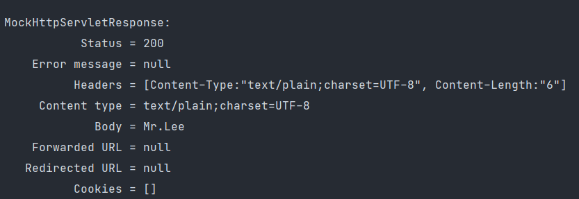

데이터 바인딩을 하는데 있어 Spring 에서 제공하는 인터페이스에는 Formatter 외에 Converter 가 있다.  
_그렇다면 Converter 와 Formatter 의 차이는 뭘까?_

```java
public interface Formatter<T> extends Printer<T>, Parser<T> {
}

@FunctionalInterface
public interface Parser<T> {
    T parse(String var1, Locale var2) throws ParseException;
}
```
Formatter 인터페이스를 살펴보면 Parser 인터페이스를 상속받고 있고, Parser 인터페이스르 살펴보면 String 값을 제너릭 타입 T로 변환하는 parse 메소드가 있음을 알 수 있다.  
즉, Formatter 는 String 과 Object 간의 데이터 변환을 수행한다.
```java
@FunctionalInterface
public interface Converter<S, T> {
    @Nullable
    T convert(S var1);

    default <U> Converter<S, U> andThen(Converter<? super T, ? extends U> after) {
        Assert.notNull(after, "After Converter must not be null");
        return (s) -> {
            T initialResult = this.convert(s);
            return initialResult != null ? after.convert(initialResult) : null;
        };
    }
}
```
Converter 인터페이스를 보면 제너릭 타입 S를 제너릭 타입 T로 변환하는 convert 메소드가 있음을 알 수 있다.  
즉, Converter 는 Formatter 와 다르게 String 뿐만 아니라 다른 타입 또한 변환이 가능하다.

## Converter 구현
```java
@Controller
public class SampleController {
    @GetMapping("/user")
    @ResponseBody
    public String getUser(@RequestParam("id") User user) {
        return user.getName();
    }
}
```
/user 라는 요청에 파라미터로 id를 받아올 때, User 객체로 변환하는 Converter 를 아래와 같이 구현하였다.
```java
@Component
public class MyConverter implements Converter<String, User> {

    @Override
    public User convert(String id) {
        return new User(Long.parseLong(id), "Mr.Lee");
    }
}
```
테스트 코드를 작성해서 확인해보자.
```java
@Test
public void getUser() throws Exception {
  this.mockMvc.perform(get("/user").param("id", "1"))
          .andDo(print())
          .andExpect(content().string("Mr.Lee"));
}
```
  

테스트 결과 파라미터 id에 1을 넣어 /user 요청을 수행했을 때, Mr.Lee 문자열을 정상적으로 리턴하는 것을 확인할 수 있다.
Converter 도 Formatter 와 마찬가지로 빈으로만 등록해주면 addConverter 메소드를 통해 Converter 로 자동 등록된다.