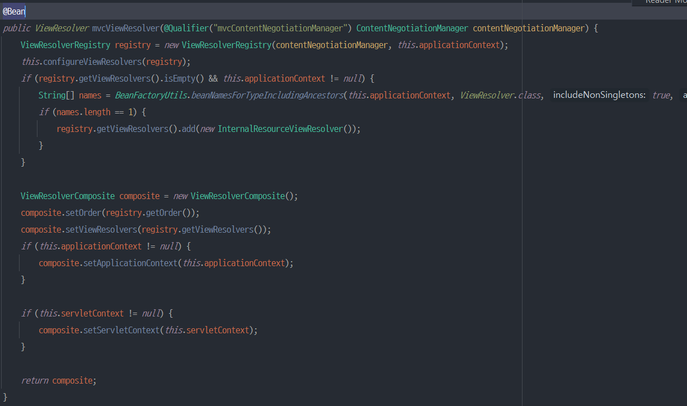

스프링 MVC 설정을 하기 위해 아래와 같이 @Configuration 어노테이션을 사용해서 자바 설정 파일에 @Bean을 사용해서 직접 등록하는 경우, 일일히 등록해줘야하는 번거로움이 있다.
```java
@Configuration
@ComponentScan
public class WebConfig {
    @Bean
    public InternalResourceViewResolver viewResolver() {
        InternalResourceViewResolver viewResolver = new InternalResourceViewResolver();
        viewResolver.setPrefix("/WEB-INF/");
        viewResolver.setSuffix(".jsp");
        return viewResolver;
    }
}
```
좀 더 편하게 사용하는 방법은 없을까 ?  
*Annotation 기반의 스프링 MVC를 사용할 때, @EnableWebMvc 어노테이션을 사용하면 좀 더 편하게 설정을 할 수 있다.*

## @EnableWebMvc 구조
```java
@Retention(RetentionPolicy.RUNTIME)
@Target({ElementType.TYPE})
@Documented
@Import({DelegatingWebMvcConfiguration.class})
public @interface EnableWebMvc {
}
```
DelegatingWebMvcConfiguration 클래스를 import 하고 있다. 이 클래스는 WebMvcConfigurationSupport 클래스를 상속하고 있고, WebMvcConfigurationSupport 클래스에서는 스프링 MVC에 필요한 빈들을 등록해주고 있다.  

DelegatingWebMvcConfiguration 클래스를 살펴보면 아래와 같은 Delegation 구조로 되어있다.  
즉 어딘가에 위임을 해서 읽어오는 식으로 구성이 되어있다. ViewResolver와 관련해서 한번 살펴보자.
```java
public class DelegatingWebMvcConfiguration extends WebMvcConfigurationSupport {
    private final WebMvcConfigurerComposite configurers = new WebMvcConfigurerComposite();

    protected void configureViewResolver(ViewResolverRegistry registry) {
        this.configurers.configureViewResolvers(registry);
    }
}
```

```java
class WebMvcConfigurerComposite implements WebMvcConfigurer {
    private final List<WebMvcConfigurer> delegates = new ArrayList();

    public void configureViewResolvers(ViewResolverRegistry registry) {
        Iterator var2 = this.delegates.iterator();

        while (var2.hasNext()) {
            WebMvcConfigurer delegate = (WebMvcConfigurer) var2.next();
            delegate.configureViewResolvers(registry);
        }
    }
}
```
WebMvcConfigurationSupport 클래스에서 ViewResolver가 Bean으로 등록될 때, DelegatingWebMvcConfiguration 클래스의 오버라이딩된 함수를 실행하는데 여기서 WebMvcConfigurerComposite의 configureViewResolvers 함수를 실행하고 결국엔 WebMvcConfigurer 구현체를 바라보게 된다.  
*따라서 WebMvcConfigurer 인터페이스를 구현하면 쉽게 커스터마이징이 가능한 구조이다.*

1. 직접 Bean 등록하는 방법
```java
@Configuration
@ComponentScan
public class WebConfig {
    @Bean
    public InternalResourceViewResolver viewResolver() {
        InternalResourceViewResolver viewResolver = new InternalResourceViewResolver();
        viewResolver.setPrefix("/WEB-INF/");
        viewResolver.setSuffix(".jsp");
        return viewResolver;
    }
}
```
2. @EnableWebMvc 사용해서 설정한 후, 커스터마이징하는 방법
```java
@Configuration
@ComponentScan
@EnableWebMvc
public class WebConfig implements WebMvcConfigurer {
    @Override
    public void configureViewResolvers(iewResolverRegistry registry) {
        registry.jsp("/WEB-INF/", ".jsp");
    }
}
```
두 가지 방법을 비교해보면 2번 방법에서 확연히 코드가 줄어들었음을 확인할 수 있다.

`여기서 한 가지 주의할 점이 있다.  `

아래 코드를 보자. Spring MVC 자동 설정과 관련된 WebMvcAutoConfiguration 클래스이다.
```java
@Configuration(
        proxyBeanMethods = false
)
@ConditionalOnWebApplication(
        type = Type.SERVLET
)
@ConditionalOnClass({Servlet.class, DispatcherServlet.class, WebMvcConfigurer.class})
@ConditionalOnMissingBean({WebMvcConfigurationSupport.class})
@AutoConfigureOrder(-2147483638)
@AutoConfigureAfter({DispatcherServletAutoConfiguration.class, TaskExecutionAutoConfiguration.class, ValidationAutoConfiguration.class})
public class WebMvcAutoConfiguration {
}
```
여기서 봐야할 것은 _@ConditionalOnMissingBean({WebMvcConfigurationSupport.class})_ 이 부분이다.
이 어노테이션이 의미는 "WebMvcConfigurationSupport 타입의 빈이 없어야만 WebMvcAutoConfiguration 클래스의 설정파일을 사용한다" 이다.  
@EnableWebMvc 는 DelegatingWebMvcConfiguration 클래스를 import 하고 있고, 이 클래스는 WebMvcConfigurationSupport 클래스를 상속받았다고 했다.  
   
**즉, @EnableWebMvc 를 사용하면 SpringBoot 자동 설정 파일을 사용하지 못하게 된다.**
따라서 SpringBoot 자동 설정을 사용하면서 추가로 커스터마이징하고 싶다면, @EnableWebMvc 어노테이션 없이 WebMvcConfigurer 인터페이스를 구현하는 Config 클래스를 생성하면 된다. 