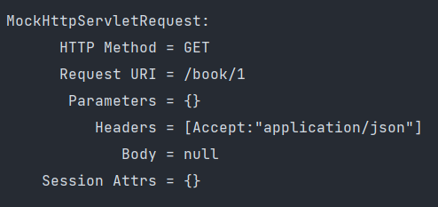
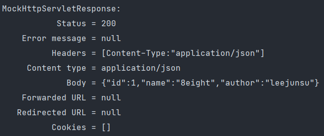
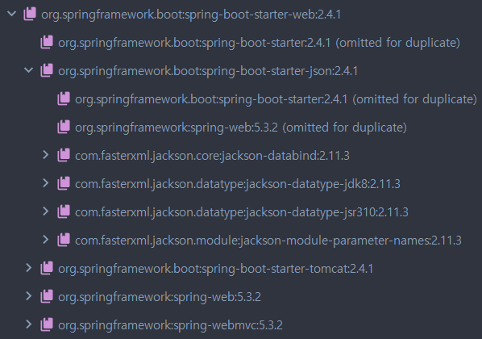

HttpMessageConverter 는 Http 요청 본문을 객체로 변환하거나(@RequestBody) 객체를 Http 응답 본문으로 변환할 때(@ResponseBody) 사용된다.

## HttpMessageConverter test 코드 작성
id, author, name을 멤버 변수로 가지는 Entity 클래스 Book과 BookRepository를 생성한 후, 아래와 같이 Controller를 작성하였다.
```java
import javax.swing.text.html.Option;
import java.awt.print.Book;
import java.util.Optional;

@Controller
public class BookController {
    private final BookRepository bookRepository;

    public BookController(BookRepository bookRepository) {
        this.bookRepository = bookRepository;
    }

    @GetMapping("/book/{id}")
    @ResponseBody
    public Optional<Book> getUser(@PathVariable long id) {
        return bookRepository.findById(id);
    }
}
```
해당 컨트롤러를 테스트하는 테스트 코드를 아래와 같이 작성하였다.
```java
@ExtendWith(SpringExtension.class)
@SpringBootTest
@AutoConfigureMockMvc
class BookControllerTest {
    @Autowired
    MockMvc mockMvc;

    @Autowired
    BookRepository bookRepository;

    @Test
    public void findByIdTest() throws Exception{
        Book book = new Book();
        book.setAuthor("leejunsu");
        book.setName("8eight");
        Book save = bookRepository.save(book);

        this.mockMvc.perform(get("/book/" + save.getId())
                    .accept(MediaType.APPLICATION_JSON))
                .andDo(print())
                .andExpect(status().isOk())
                .andExpect(jsonPath("$.id").value(1))
                .andExpect(jsonPath("$.author").value("leejunsu"))
                .andExpect(jsonPath("$.name").value("8eight"))
        ;
    }
}
```
헤더 정보에 따라 적절한 HttpMessageConverter를 선택하게 되는데, @ResponseBody를 사용할때는 헤더 설정에서 Accept 부분을 참고하고, @RequestBody를 사용할 때는 Content-type 부분을 참고한다.  
위 컨트롤러에서는 @ResponseBody를 사용했으므로 테스트 코드에서 accept 메소드를 사용해서 헤더 설정에 json 타입을 넘겨줬다.

  

request 정보를 보면 Header에 Accept에 "application/json" 타입이 설정되었음을 확인할 수 있다. 테스트 결과가 성공적이라면 json 타입으로 결과가 나올 것이다.

  

Http Response Body를 확인해보면 json 타입으로 결과가 정상적으로 나왔음을 확인할 수 있다.
_**HttpMessageConverter를 따로 설정해주지 않았음에도 json 타입으로 변환이 성공적으로 일어난 이유는 뭘까?**_

## HttpMessageConverter 설정
Spring MVC 설정을 도와주는 WebMvcConfigurationSupport 클래스를 살펴보자.  
addDefaultHttpMessageConverters 메소드를 통해 기본적으로 ByteArrayHttpMessageConverter, StringHttpMessageConverter, ResourceHttpMessageConverter, ResourceRegionHttpMessageConverter가 생성하고 있고, boolean 값에 따라 해당 컨버터들을 생성하고 있다. 
```java
public class WebMvcConfigurationSupport implements ApplicationContextAware, ServletContextAware {
    private static final boolean romePresent;
    private static final boolean jaxb2Present;
    private static final boolean jackson2Present;
    private static final boolean jackson2XmlPresent;
    private static final boolean jackson2SmilePresent;
    private static final boolean jackson2CborPresent;
    private static final boolean gsonPresent;
    private static final boolean jsonbPresent;
    protected final void addDefaultHttpMessageConverters(List<HttpMessageConverter<?>> messageConverters) {
        messageConverters.add(new ByteArrayHttpMessageConverter());
        messageConverters.add(new StringHttpMessageConverter());
        messageConverters.add(new ResourceHttpMessageConverter());
        messageConverters.add(new ResourceRegionHttpMessageConverter());
        if (!shouldIgnoreXml) {
            try {
                messageConverters.add(new SourceHttpMessageConverter());
            } catch (Throwable var3) {
            }
        }

        messageConverters.add(new AllEncompassingFormHttpMessageConverter());
        if (romePresent) {
            messageConverters.add(new AtomFeedHttpMessageConverter());
            messageConverters.add(new RssChannelHttpMessageConverter());
        }

        Jackson2ObjectMapperBuilder builder;
        if (!shouldIgnoreXml) {
            if (jackson2XmlPresent) {
                builder = Jackson2ObjectMapperBuilder.xml();
                if (this.applicationContext != null) {
                    builder.applicationContext(this.applicationContext);
                }
                messageConverters.add(new MappingJackson2XmlHttpMessageConverter(builder.build()));
            } else if (jaxb2Present) {
                messageConverters.add(new Jaxb2RootElementHttpMessageConverter());
            }
        }

        if (kotlinSerializationJsonPresent) {
            messageConverters.add(new KotlinSerializationJsonHttpMessageConverter());
        }

        if (jackson2Present) {
            builder = Jackson2ObjectMapperBuilder.json();
            if (this.applicationContext != null) {
                builder.applicationContext(this.applicationContext);
            }
            messageConverters.add(new MappingJackson2HttpMessageConverter(builder.build()));
        } else if (gsonPresent) {
            messageConverters.add(new GsonHttpMessageConverter());
        } else if (jsonbPresent) {
            messageConverters.add(new JsonbHttpMessageConverter());
        }

        if (jackson2SmilePresent) {
            builder = Jackson2ObjectMapperBuilder.smile();
            if (this.applicationContext != null) {
                builder.applicationContext(this.applicationContext);
            }
            messageConverters.add(new MappingJackson2SmileHttpMessageConverter(builder.build()));
        }

        if (jackson2CborPresent) {
            builder = Jackson2ObjectMapperBuilder.cbor();
            if (this.applicationContext != null) {
                builder.applicationContext(this.applicationContext);
            }

            messageConverters.add(new MappingJackson2CborHttpMessageConverter(builder.build()));
        }
    }
}
```
static final boolean 변수의 값은 아래와 같이 Class 파일의 존재 여부를 통해 설정하고 있다.  
즉, 의존성을 추가하면 해당 클래스의 여부에 따라 자동으로 컨버터들을 생성해주는 것이다.
```java
static {
    ClassLoader classLoader = WebMvcConfigurationSupport.class.getClassLoader();
    romePresent = ClassUtils.isPresent("com.rometools.rome.feed.WireFeed", classLoader);
    jaxb2Present = ClassUtils.isPresent("javax.xml.bind.Binder", classLoader);
    jackson2Present = ClassUtils.isPresent("com.fasterxml.jackson.databind.ObjectMapper", classLoader) && ClassUtils.isPresent("com.fasterxml.jackson.core.JsonGenerator", classLoader);
    jackson2XmlPresent = ClassUtils.isPresent("com.fasterxml.jackson.dataformat.xml.XmlMapper", classLoader);
    jackson2SmilePresent = ClassUtils.isPresent("com.fasterxml.jackson.dataformat.smile.SmileFactory", classLoader);
    jackson2CborPresent = ClassUtils.isPresent("com.fasterxml.jackson.dataformat.cbor.CBORFactory", classLoader);
    gsonPresent = ClassUtils.isPresent("com.google.gson.Gson", classLoader);
    jsonbPresent = ClassUtils.isPresent("javax.json.bind.Jsonb", classLoader);
    kotlinSerializationJsonPresent = ClassUtils.isPresent("kotlinx.serialization.json.Json", classLoader);
}
```
  
```text
<dependency>
    <groupId>org.springframework.boot</groupId>
    <artifactId>spring-boot-starter-web</artifactId>
</dependency>
```
json의 경우, 위와 같이 spring-boot-starter-web 의존성을 추가했을 때, json과 관련된 의존성도 같이 추가되어 있음을 확인할 수 있다. 따라서 따로 json과 관련된 HttpMessageConverter를 따로 설정해주지 않아도 의존성 정보에 따라 자동 생성되었기 때문에 사용할 수 있었던 것이다.