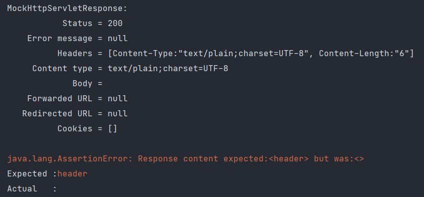

## Http Method 란?
Http(Hyper Text Transfer Protocol)는 클라이언트와 서버 사이에 이루어지는 요청/응답(request/response) 프로토콜이다. Http Method는 서버로 보내는 요청의 방법이라 할 수 있고, 종류에는 GET, POST, PUT, DELETE, PATCH 등이 있다.

## 응답 코드
클라이언트가 서버에 어떤 요청을 하면 서버는 세 자리 수로 된 응답 코드와 함께 결과를 응답한다.

1XX : 정보 교환  
2XX : 데이터 전송이 성공적으로 이루어졌거나, 이해되었거나, 수락됨
- 200 : OK (오류 없이 전송 성공)

3XX : 자료의 위치가 바뀜  
4XX : 클라이언트 측의 오류  
- 404 : Not Found(문서를 찾을 수 없음)
- 405 : Method Not Allowed(메서드 허용 안됨)
- 415 : Unsupported Media Type

5XX : 서버 측 오류
- 500 : Internal Server Error(서버 내부 오류)

## Http Method Mapping 하는 법
1. 클래스 레벨에서 선언하는 방법
```java
@Controller
@RequestMapping(value = "/hello", method = RequestMethod.GET)
public class HelloController {
}
```
위와 같이 컨트롤러 클래스 상단에 @RequestMapping 어노테이션을 사용해서 매핑할 수 있다. "/hello" 로 시작하는 요청을 처리하는 클래스가 된다.

2. 메소드 레벨에서 선언하는 방법
```java
@Controller
@RequestMapping(value = "/hello", method = RequestMethod.GET)
public class HelloController {
    @RequestMapping(value = "/list", method = {RequestMethod.GET, RequestMethod.PUT})
    @ResponseBody
    public String getList() {
        return "hello";
    }
}
```
위와 같이 메소드 레벨에서 선언하여 매핑할 수도 있다. method field 값에 RequestMethod enum을 활용하여 Http Method Type을 설정할 수 있고, 여러 개의 Http Method Type을 같이 설정해줄 수도 있다. 위 getList 메소드의 경우, "/hello/list" 로 들어오는 PUT, GET 요청을 처리한다.
```text
@RequestMapping(value = "/list", method = RequestMethod.GET)
```
위 어노테이션을 아래와 같이 간단하게 사용할 수 있다. Http Method에 따라 @PostMapping, @PutMapping, @DeleteMapping, @PatchMapping을 사용하면 된다.
```text
@GetMapping("/list")
```

## MediaType 지정
@RequestMapping 어노테이션을 사용해서 미디어 타입을 지정해줄 수 있다.  
consumes 필드에 지정한 값에 따라 들어오는 요청을 제한할 수 있다.
```java
@Controller
public class HelloController {
    @RequestMapping(value = "/list", consumes = MediaType.APPLCATION_JSON_VALUE)
    @ResponseBody
    public String getList() {
        return "hello";
    }
}
```
위와 같은 컨트롤러가 있다고 하자. consumes 필드를 통해 JSON 타입으로 미디어 타입을 지정했다. 
```java
class EventControllerTest {
    @Test
    public void getHttpMethodTest() throws Exception {
        this.mockMvc.perform(get("/list"))
                .andDo(print())
                .andExpect(status().isOk())
                .andExpect(content().string("hello"))
                .andExpect(handler().handlerType(HelloController.class));
    }
}
```
테스트를 실행해보자. 위 테스트는 정상적으로 통과되지 않을 것이다.  
결과는 415 응답코드(Unsupported Media Type)가 나타난다.  
요청을 처리하는 컨트롤러의 메소드에서 미디어 타입으로 JSON의 요청만 처리한다고 지정했는데, 테스트 코드에서 미디어 타입을 지정해주지 않았기 때문에 MockHttpServletRequest Header에 아무런 정보가 없기 때문이다.
따라서 아래와 같이 테스트 코드를 수정해야한다.
```java
class EventControllerTest {
    @Test
    public void getHttpMethodTest() throws Exception {
        this.mockMvc.perform(get("/list").contentType(MediaType.APPLICATION_JSON))
                .andDo(print())
                .andExpect(status().isOk())
                .andExpect(content().string("hello"))
                .andExpect(handler().handlerType(HelloController.class));
    }
}
```
Header에 Content-Type 정보를 넘겨주면서 정상적으로 요청을 처리할 수 있게 된다.  

아래와 같이 produces 필드에 지정한 값에 따라 응답 타입을 보장해줄 수 있다.
```java
@Controller
public class HelloController {
    @RequestMapping(value = "/list"
            , consumes = MediaType.APPLCATION_JSON_VALUE
            , produces = MediaType.APPLICATION_JSON_VALUE)
    @ResponseBody
    public String getList() {
        return "hello";
    }
}
```
응답 미디어 타입의 경우, 따로 accept로 지정해주지 않아도 정상적으로 테스트가 통과되었다. 응답 미디어 타입을 지정하지 않았으니까 요청 처리할 때 지정해준 미디어 타입으로 그대로 반환이 되서 그런가보다.  

※ 참고로 미디어 타입을 지정해줄 때, 문자값을 주는 것보단 MediaType 클래스에 이미 정의된 상수값을 사용하는 것이 오타도 방지하고 더 효율적이다. 
## Http Header Parameter Mapping
Http Request Header에 parameter 존재 여부에 따라 요청을 제한할 수 있다.
아래 코드를 보자. headers 필드에 HttpHeaders 클래스에 정의된 상수 ALLOW를 설정했다. Http 요청 헤더에 ALLOW key에 해당 하는 값이 있는 요청인 경우에만 처리하겠다는 뜻이다.
```java
@Controller
public class HelloController {
    @RequestMapping(value = "/list"
            , headers = HttpHeaders.ALLOW)
    @ResponseBody
    public String getHttpMethod() {
        return "get";
    }
}
```
테스트 코드를 작성해보자. 
```java
class EventControllerTest {
    @Test
    public void getHttpMethodTest() throws Exception {
        this.mockMvc.perform(get("/list")
                .header(HttpHeaders.ACCESS_CONTROL_ALLOW_CREDENTIALS, "hi"))
                .andDo(print())
                .andExpect(status().isOk())
                .andExpect(content().string("get"))
                .andExpect(handler().handlerType(EventController.class));
    }
}
```
  
Header 정보에 ACCESS_CONTROL_ALLOW_CREDENTIALS 키 값을 넘겨줬다. 테스트 결과는 어떨까? 실패한다.  
요청을 처리하는 컨트롤러 메소드에 정의한 Header 키 값은 ALLOW 이기때문이다. 해당 키 값이 헤더에 존재하지 않기 때문에 실패한다. 
```java
class EventControllerTest {
    @Test
    public void getHttpMethodTest() throws Exception {
        this.mockMvc.perform(get("/list")
                .header(HttpHeaders.ALLOW, "hi"))
                .andDo(print())
                .andExpect(status().isOk())
                .andExpect(content().string("get"))
                .andExpect(handler().handlerType(EventController.class));
    }
}
```
위와 같이 고치면 정상적으로 테스트가 통과된다. 
혹은 아래와 같이 "!" 를 붙여주면 해당 키 값이 없는 경우, 해당 요청을 처리하게 된다.
```java
@Controller
public class HelloController {
    @RequestMapping(value = "/list"
            , headers = "!" + HttpHeaders.ALLOW)
    @ResponseBody
    public String getHttpMethod() {
        return "get";
    }
}
```

## Http Method HEAD, Options
Http Method 를 간단히 매핑하게끔 만들어진 어노테이션은 @GetMapping, @PostMapping, @DeleteMapping, @PatchMapping, @PutMapping 이렇게 5가지가 있다. 그럼 Http Method 중 HEAD, OPTIONS는 왜 없을까?

1. HEAD
> The HEAD method is identical to GET except that the server MUST NOT return a message-body in the response. The metainformation contained in the HTTP headers in response to a HEAD request SHOULD be identical to the information sent in response to a GET request.

HEAD method 는 GET 과 동일하다고 설명하고 있다. 즉, HEAD Method로 요청을 보내도 GET으로 매핑된 메소드에 의해 처리가 된다는 것이다.
테스트를 해보자. 
```java
public class EventController {
    @GetMapping("/header")
    @ResponseBody
    public String getHttpMethodHeader() {
        return "header";
    }
}
```
GET Method 요청을 처리하는 메소드를 위와 같이 작성했다. HEAD Method로 요청을 보내는 테스트 코드를 아래와 같이 작성했다. 결과는 어떨까? 
```java
class EventControllerTest {
    @Test
    public void getHttpMethodHeader() throws Exception {
        this.mockMvc.perform(head("/header"))
                .andDo(print())
                .andExpect(status().isOk())
                .andExpect(content().string("header"));
    }
}
```
  

결과는 위와 같이 실패한다. 왜냐하면 HEAD Method 는 GET 과 동일하지만 응답에 body가 없기 때문이다. 그래서 응답으로 body에 "header"라는 문자가 담겨있기를 기대하지만 실제 결과에는 없으므로 실패하는 것이다.
따라서 ".andExpect(content().string("header"))" 이 부분을 삭제하고 테스트를 실행하면 정상적으로 통과한다. 

2. OPTIONS  
OPTIONS Method는 해당 URI 요청을 처리하는 Http Method의 정보를 확인하기 위해서 사용한다.
   
```java
public class EventController {
    @GetMapping("/header")
    @ResponseBody
    public String getHttpMethodHeader() {
        return "header";
    }

    @PostMapping("/header")
    @ResponseBody
    public String getHttpMethodHeader2() {
        return "header";
    }
}
```
"/header" 요청을 처리하는 GET, POST 메소드를 작성한 후, 테스트를 실행하면 아래와 같은 결과가 나온다.
응답 헤더에 보면 POST, GET, HEAD, OPTIONS method에 대해 해당 URI가 처리된다는 정보를 확인할 수 있다.


<br>

참고 : <https://ko.wikipedia.org/wiki/HTTP#%EC%9A%94%EC%B2%AD_%EB%A9%94%EC%8B%9C%EC%A7%80>  
<https://www.w3.org/Protocols/rfc2616/rfc2616-sec9.html>