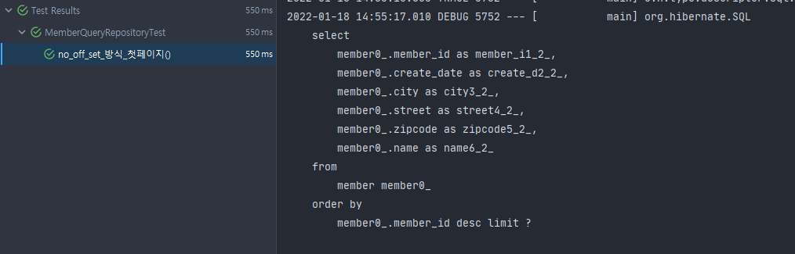
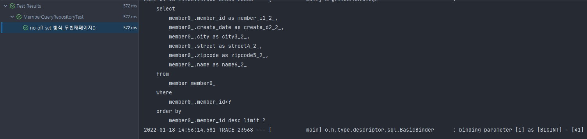

일반적인 페이징 방식의 성능을 개선하는 방식 중 No Offset 방식을 알게되어 정리하고자 합니다.</br>

## 일반적인 페이징 방식이 왜 문제일까요?
일반적인 페이징 방식은 페이지 번호(offset)와 페이지 사이즈(limit)를 기반으로 동작합니다.</br>
아래와 같은 형태의 쿼리로 동작합니다.
```
select *
from member
where 조건문
offset 페이지 번호
limit 페이지 사이즈
```
이와 같은 형태의 쿼리가 문제인 이유는 페이지 번호가 뒤로 갈수록 앞에서 읽었던 행을 또 다시 읽어야 하기 때문입니다.</br>
예를 들어 아래와 같은 쿼리가 있다고 합시다. 아래의 쿼리는 동일하게 처음 10개의 행을 반환하는 쿼리입니다.
```
SELECT * FROM MEMBER LIMIT 10
SELECT * FROM MEMBER OFFSET 0 LIMIT 10
```
그렇다면 아래의 쿼리를 봅시다. 쿼리는 11번째부터 10개의 행을 반환하는 쿼리입니다.
```
SELECT * FROM MEMBER OFFSET 10 LIMIT 10
```
문제는 이 쿼리가 전체 20개의 행을 다 읽은 후에 앞에 10개는 버리고 마지막 10개를 반환하는 것입니다. </br>
그러니 페이지 번호가 뒤로 갈수록 필요한 데이터는 똑같이 마지막 10개뿐이지만 읽어야할 데이터는 점점 늘어나니 느려질 수 밖에 없습니다.

## No offset 방식
그렇다면 No offset 방식은 뭘까요? </br>
No offset 방식은 아래와 같이 조회 시작 조건을 정해줌으로써 매번 첫 페이지만 읽도록 하는 방식입니다.</br>
인덱스인 member_id(PK)를 조회 시작 조건으로 사용하므로 빠르게 조회가 가능합니다.
```
select
    member0_.member_id as member_i1_2_,
    member0_.create_date as create_d2_2_,
    member0_.city as city3_2_,
    member0_.street as street4_2_,
    member0_.zipcode as zipcode5_2_,
    member0_.name as name6_2_ 
from
    member member0_ 
where
    member0_.member_id < 마지막 조회 ID
order by
    member0_.member_id desc 
limit 페이지 사이즈 
```

### 1. No offset 구현

#### No offset 코드
```java
public List<Member> noOffSet(Long id, String name, int limit) {
    return jpaQueryFactory
            .selectFrom(member)
            .where(eqName(name), memberIdLt(id))
            .orderBy(member.id.desc())
            .limit(limit)
            .fetch();
}

private BooleanExpression eqName(String name) {
    if  (Objects.isNull(name)) {
        return null;
    }
    return member.name.eq(name);
}

private BooleanExpression memberIdLt(Long id) {
    return id != null ? member.id.lt(id) : null;
}
```
인덱스인 member_id를 조회 기준으로 사용했습니다. 다만 첫 페이지와 두번째 페이지부터 조회할 경우 사용되는 쿼리가 달라 동적 쿼리가 필요하므로 BooleanExpression을 사용하여 조건문을 만들어줍니다.

### 2. 기능 검증
test 코드를 작성하여 기능을 검증해보겠습니다.

#### No offset 첫 페이지 테스트 코드
```java
@Test
void no_off_set_방식_첫페이지() throws Exception {
    for (int i = 1;i <= 50;i++) {
        memberRepository.save(Member.builder()
                .name(i + "junsu")
                .address(new Address("seoul", "mapo", "01234"))
                .build());
    }
    List<Member> members = memberQueryRepository.noOffSet(null, null, 10);

    assertEquals(members.get(0).getName(), "50junsu");
    assertEquals(members.get(9).getName(), "41junsu");
}
```
첫 페이지는 id를 모르기 때문에 id 값에 null을 입력했습니다.</br>
테스트 결과 아래와 같이 성공하는 것을 확인할 수 있습니다.


#### No offset 두번째 페이지 테스트 코드
```java
@Test
void no_off_set_방식_두번째페이지() throws Exception {
    for (int i = 1;i <= 50;i++) {
        memberRepository.save(Member.builder()
                .name(i + "junsu")
                .address(new Address("seoul", "mapo", "01234"))
                .build());
    }
    List<Member> members = memberQueryRepository.noOffSet(41L, null, 10);

    assertEquals(members.get(0).getName(), "40junsu");
    assertEquals(members.get(9).getName(), "31junsu");
}
```
두번째 페이지는 첫 페이지에서 마지막 조회 ID인 41을 id 값에 입력했습니다.</br>
테스트 결과 아래와 같이 성공하는 것을 확인할 수 있습니다.
