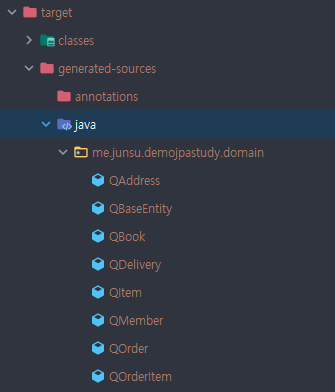

## 의존성 추가하기
QueryDsl 관련 라이브러리
```
<dependency>
    <groupId>com.querydsl</groupId>
    <artifactId>querydsl-jpa</artifactId>
    <version>4.2.1</version>
</dependency>
```
Q클래스 생성
```
<dependency>
    <groupId>com.querydsl</groupId>
    <artifactId>querydsl-apt</artifactId>
    <version>4.2.1</version>
</dependency>
```

## 플러그인 추가하기
queryDsl 기반 코드를 생성하기 위한 플러그인을 추가한다.
Entity 어노테이션이 추가된 도메인에 대해 outputDirectory에 설정한 경로에 query type을 생성해준다.
```
<plugin>
    <groupId>com.mysema.maven</groupId>
    <artifactId>apt-maven-plugin</artifactId>
    <version>1.1.3</version>
    <executions>
        <execution>
            <goals>
                <goal>process</goal>
            </goals>
            <configuration>
                <outputDirectory>target/generated-sources/java</outputDirectory>
                <processor>com.querydsl.apt.jpa.JPAAnnotationProcessor</processor>
            </configuration>
        </execution>
    </executions>
</plugin>
```

## Q클래스 생성
인텔리제이 기준 Maven 마우스 우 클릭 > Generate Sources and Update Folders 을 선택한다.</br>
위 플러그인 설정에서 outputDirectory에 설정한 경로에 아래와 같이 Q클래스가 생성된다.

 