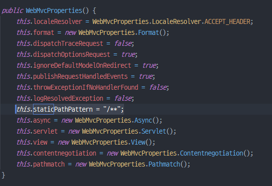

servlet web application 에서 클라이언트의 모든 요청을 DispatcherServlet 이 받아 해당 요청을 처리할 컨트롤러에게 위임하게 되는데, 매핑되는 URL이 없는 경우, DefaultServletHttpRequestHandler를 통해 DefaultServlet에게 요청에 대한 처리를 위임하게 된다.   

tomcat의 conf 폴더에 있는 web.xml을 확인해보면 아래와 같다.

  
  

url-pattern(/)에 대해 DefaultServlet이 처리하도록 매핑되어 있다. 

**url-pattern에 대해서 주의해야할 점에 대해 알아보자.** 
```java
public class WebApplication implements WebApplicationInitializer {
    @Override
    public void onStartup(ServletContext servletContext) throws ServletException {
        AnnotationConfigWebApplicationContext webApplicationContext = new AnnotationConfigWebApplicationContext();
        webApplicationContext.register(WebConfig.class);
        webApplicationContext.setServletContext(servletContext);
        webApplicationContext.refresh();

        DispatcherServlet dispatcherServlet = new DispatcherServlet(webApplicationContext);
        ServletRegistration.Dynamic app = servletContext.addServlet("app", dispatcherServlet);
        app.addMapping("/*");
    }
}
```
dispatcher servlet의 url-pattern을 위와 같이 "/&#42;" 이라고 설정하는 경우, application을 실행시키면 index.jsp를 찾을 수 없어서 404 에러가 발생하게 된다.
_도대체 이유가 뭘까?_  

"/&#42;"이 의미하는 것은 모든 요청에 대해 DispatcherServlet이 처리하겠다는 뜻이다. "/"에 대한 요청을 처리할 컨트롤러를 찾지만 설정해둔게 없기 때문에 "org.springframework.web.servlet.DispatcherServlet.noHandlerFound No mapping for GET /" 와 함께 404 에러를 리턴하는 것이다.

_그렇다면 해결 방법은 뭘까?_  

바로 url-pattern을 "/"으로 바꾸는 것이다. 바꾸고 나면 문제없이 index.jsp가 호출될 것이다. 하지만 정적 리소스를 요청하면 404 에러가 날 것이다. 왜냐하면 tomcat의 web.xml에 정의된 default servlet url-patten과 동일하기 때문에 해당 요청을 dispatcher servlet이 처리하려고 하다보니 생기는 문제이다.
따라서 해당 요청을 default servlet이 처리하도록 설정해줘야 한다.
```java
@Configuration
@ComponentScan(includeFilters = @ComponentScan.Filter(Controller.class))
@EnableWebMvc
public class WebConfig implements WebMvcConfigurer {
    @Override
    public void configureViewResolvers(ViewResolverRegistry registry) {
        registry.jsp("/WEB-INF/", ".jsp");
    }

    @Override
    public void configureDefaultServletHandling(DefaultServletHandlerConfigurer configurer) {
        configurer.enable();
    }
}
```
WebMvcConfigurer를 구현한 WebConfig 클래스에 configureDefaultServletHandling 메소드를 구현해준다.  
설정하고나면 http://localhost:8080/resources/fcb.jpg 이렇게 정적 리소스에 접근할 경우 아무런 문제없이 처리가 된다.  

## SpringBoot 에서 정적 리소스 설정

SpringBoot에서는 스프링 MVC 관련 설정들을 자동으로 해주는 데, 정적 리소스 관련 설정 또한 기본적으로 지원한다.  

먼저 static 디렉토리 안에 sample.html을 생성하고 실행시켜보자. 
```html
<!DOCTYPE html>
<html lang="en">
<head>
    <meta charset="UTF-8">
    <title>Title</title>
</head>
<body>
<h1>Static Resources Sample Page</h1>
</body>
</html>
```

  

결과는 보시다시피 정상적으로 호출이 되는 것을 확인할 수 있다.  
_왜 이렇게 될까?_  

  

autoconfig 설정에 보면 addResourceHandler 메소드가 있다. 이 메소드를 살펴보면 property 정보를 기반으로 정적 리소스를 처리하는 ResourceHandler를 추가하고 있음을 확인할 수 있다.

  
  

기본 패턴은 "/**"으로 설정되어있고, 파일이 위치하는 경로는 "classpath:/META-INF/resources/", "classpath:/resources/", "classpath:/static/", "classpath:/public/" 이렇게 설정되어 있다.   
따라서 http://localhost:8080/sample.html 을 요청하면 정적 리소스 위치에서 해당 파일을 찾아서 응답한다. 

경로를 바꾸고 싶다거나 패턴을 바꾸고 싶은 경우, 커스터마이징 방법 또한 지원한다.

1. application.properties 에 설정 추가하기  
  
   위와 같이 새로운 디렉토리 경로에 hello.html 파일을 만든 후, application.properties 파일에 아래 설정을 추가하였다.
   ```text
   spring.web.resources.static-locations=classpath:/sample/
   ```
     
정상적으로 호출되는 것을 확인할 수 있다.
   

2. WebMvcConfigurer 인터페이스 구현하기
   ```java
   @Configuration
   //@EnableWebMvc
   public class WebConfig implements WebMvcConfigurer {
   @Override
   public void addInterceptors(InterceptorRegistry registry) {
   registry.addInterceptor(new MyInterceptor());
   }
   
       @Override
       public void addFormatters(FormatterRegistry registry) {
           registry.addFormatter(new PersonFormatter());
       }
   
       @Override
       public void addResourceHandlers(ResourceHandlerRegistry registry) {
           registry.addResourceHandler("/**")
                   .addResourceLocations("classpath:/sample/");
       }
   }
   ```
addResourceHandler 메소드를 구현해주면 패턴과 정적 리소스 위치, 쿠키 설정 등을 커스터마이징 할 수 있다.
