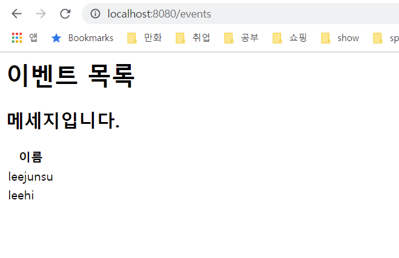

SpringBoot에서는 template engine으로 thymeleaf를 사용하기를 권장하고 있다. 그래서 그런지 SpringBoot로 프로젝트를 생성할 때, JSP 관련 의존성을 추가할 수 있는게 없다. 그렇다면 JSP를 사용하지 못하는 걸까? 다행히도 권장하지는 않지만 기능은 정상적으로 제공하고 있다. 

## 1. 의존성 추가
```text
<dependency>
    <groupId>javax.servlet</groupId>
    <artifactId>jstl</artifactId>
    <version>1.2</version>
</dependency>

<dependency>
    <groupId>org.apache.tomcat.embed</groupId>
    <artifactId>tomcat-embed-jasper</artifactId>
    <version>9.0.40</version>
    <scope>provided</scope>
</dependency>
```
jstl과 jsp를 사용하기 위한 의존성을 추가해준다.

## 2. 컨트롤러 생성
```java
@Controller
public class EventController {
    @GetMapping("/events")
    public String getEvents(Model model) {
        Event event1 = new Event();
        event1.setName("leejunsu");
        Event event2 = new Event();
        event2.setName("leehi");
        List<Event> eventList = List.of(event1, event2);

        model.addAttribute("events", eventList);
        model.addAttribute("msg", "메세지입니다.");

        return "index";
    }
}
```
/events 요청을 처리하는 컨트롤러를 작성한다.

## 3. jsp 파일 생성
```html
<%@ page contentType="text/html;charset=UTF-8" language="java" %>
<%@ taglib uri="http://java.sun.com/jsp/jstl/core" prefix="c" %>
<html>
<head>
    <title>sample</title>
</head>
<body>
<h1>이벤트 목록</h1>
<h2>${msg}</h2>
<table>
    <tr>
        <th>이름</th>
    </tr>
    <c:forEach items="${events}" var="event">
        <tr>
            <td>${event.name}</td>
        </tr>
    </c:forEach>
</table>
</body>
</html>
```
jstl을 사용하기 위해서 <%@ taglib uri="http://java.sun.com/jsp/jstl/core" prefix="c" %> 태그를 선언해준다.
여기서 jsp 파일의 경우, 디렉토리를 webapp/WEB-INF에 위치시킨다.

## 4. suffix, prefix 설정
```text
spring.mvc.view.prefix=/WEB-INF/jsp/
spring.mvc.view.suffix=.jsp
```
application.properties 파일에 ViewResolver 관련 설정을 추가해준다.

## 5. 결과 확인
