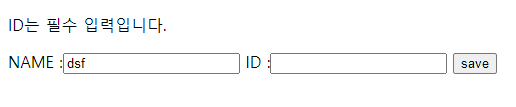

일반적으로 validation 은 여러 계층에 걸쳐서 진행되다보니 코드가 중복되고 추적이 어렵다는 단점이 있다. 이러한 방식을 대신하여 데이터 검증을 위한 로직을 도메인 모델에 표현하는 방법이 있다. **자바에서 Bean Validation 이라해서  다양한 제약조건들을 도메인 모델에 어노테이션으로 정의할 수 있게한다.**

스프링에서 어떻게 사용하는지 알아보자.
## 1. 의존성 추가
먼저 spring-boot-starter-validation 의존성을 추가한다.
```text
<dependency>
    <groupId>org.springframework.boot</groupId>
    <artifactId>spring-boot-starter-validation</artifactId>
</dependency>
```

## 2. 제약조건 작성
Entity 객체와 DTO 객체를 분리하여 사용하고 있으므로 DTO 객체에 제약조건을 작성했다.
String 타입에는 @NotBlank 뿐만 아니라 @NotNull, @NotEmpty 도 적용할 수 있다.  
@NotNull 의 경우, 말 그대로 Null 만 허용하지 않고, @NotEmpty 의 경우,  Null과 ""을 허용하지 않으며, @NotBlank 는 Null, "", " " 모두 허용하지 않는다.
```java
@Getter
@Setter
public class MemberDto {
    private Long id;
    @NotBlank(message = "ID는 필수 입력입니다.")
    private String user;
    @NotBlank(message = "이름은 필수 입력입니다.")
    private String name;
}
```

## 3. 유효성 검증
@Valid(@Validated) 어노테이션을 붙이기만 하면 해당 객체에 대해 데이터 유효 검증을 할 수 있다. 
해당 결과는 BindingResult 에 담아진다. hasErrors() 메소드를 사용해서 try-catch 문처럼 사용할 수 있다.
```java
@Controller
@RequestMapping("/member")
@RequiredArgsConstructor
public class MemberController {
    private final MemberService memberService;

    @PostMapping("/join")
    public String joinMember(@ModelAttribute @Valid MemberDto memberDto,
                             BindingResult bindingResult) {
        if (bindingResult.hasErrors()) {
            return "/member/join";
        }
        Long saveMember = memberService.saveMember(memberDto);
        return "redirect:/member/list";
    }
}
```
### 3-1. @Valid 와 @Validated 차이
위에서 @Valid 와 @Validated 어노테이션을 사용하면 된다고 했는데, 그럼 두 어노테이션은 뭐가 다른걸까?
@Validated 의 경우, Grouping 을 해서 사용할 수 있다.

### 3-2. Grouping
```java
public class ValidationGroup {
    public interface group1 {};
    public interface group2 {};
}
```
단순히 그룹을 나누기 위한 마커인터페이스를 작성한다. 그리고 제약 조건에 해당 그룹을 추가해준다.
```java
@Getter
@Setter
public class MemberDto {
    private Long id;
    @NotBlank(message = "ID는 필수 입력입니다.", groups = ValidationGroup.group1.class)
    private String user;
    @NotBlank(message = "이름은 필수 입력입니다.", groups = ValidationGroup.group2.class)
    private String name;
}
```
```java
@Controller
@RequestMapping("/member")
@RequiredArgsConstructor
public class MemberController {
    private final MemberService memberService;

    @PostMapping("/join")
    public String joinMember(@ModelAttribute @Validated(ValidationGroup.group1.class) MemberDto memberDto,
                             BindingResult bindingResult) {
        if (bindingResult.hasErrors()) {
            return "/member/join";
        }
        Long saveMember = memberService.saveMember(memberDto);
        return "redirect:/member/list";
    }
}
```
@Validated 어노테이션을 사용해서 어떤 그룹을 체크할 것인지 정의해준다.
위와 같이 작성한 경우, name 필드에 대해 @NotBlank 제약조건이 붙어있음에도 해당 제약조건을 검증하지 않는다.

## 4. View 작성(thymeleaf)
```html
<p th:if="${#fields.hasErrors('name')}" th:errors="*{name}"></p>
<p th:if="${#fields.hasErrors('user')}" th:errors="*{user}"></p>
```
thymeleaf 문법을 참고하여 위와 같이 작성하였다. 
해당 필드에 오류가 있는 경우, View 에 해당 오류를 나타내겠다는 뜻이다. 

## 5. 결과

위와 같이 입력 필드 위에 제약 조건에 따른 오류 메세지가 나타나게 된다.

이상 간단하게 사용하는 방법을 정리해보았다. 커스텀 제약 조건을 만들 수도 있고, 타입별로 다양한 제약조건 어노테이션도 있다. 데이터 검증에 대한 오류 메시지 처리도 커스텀하게 구현할 수 있을 것이다.(@ControllerAdvice 어노테이션 사용해서?)  
음.. 일단 이정도로 간단하게 정리하고, 추후에 좀 더 공부하고 보강해야겠다.  