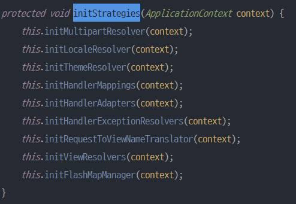
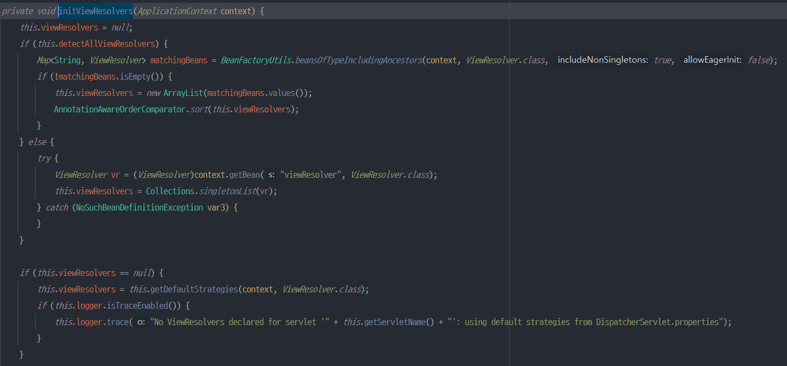
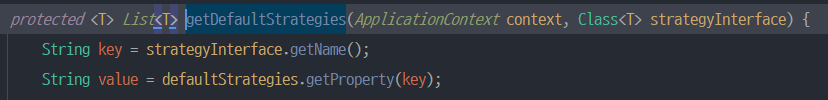
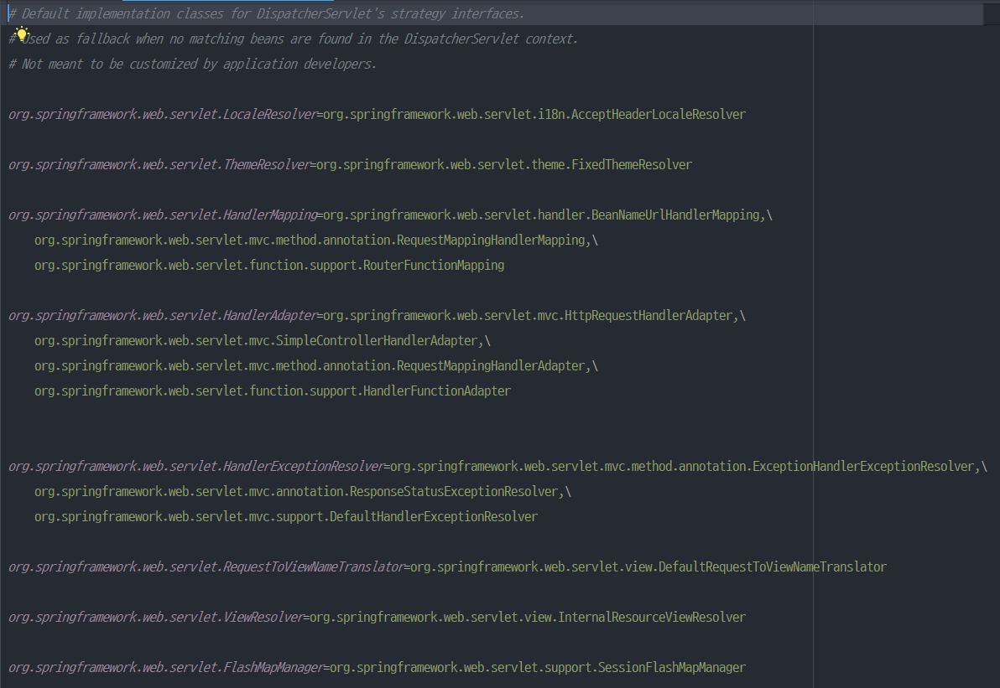

## 1. ViewResolver 란?
SpringBoot 기반 어플리케이션에서 Controller에서 아래와 같이 문자열을 리턴하는 경우, 해당 문자열의 View가 실행되는데 이게 바로 **ViewResolver**의 덕분이다. 
```java
@Controller
public class EventController {
    @GetMapping("/hello")
    public String hello() {
        return "hello";
    }
}
```
즉, ViewResolver는 사용자가 요청한 것에 대한 응답 View를 렌더링하는 역할을 수행한다.
<br></br>
## 2. DispatcherServlet의 ViewResolver
DispatchServlet에서 ViewResolver는 어떻게 생성될까?



Servlet의 생명주기에 따르면 최초 1회 초기화될 때, init() 메소드가 실행된다.

이 때, 위 그림과 같이 모두 init이 된다. 



initViewResolver() 메소드를 자세히 살펴보면 모든 타입의 ViewResolver를 찾아보고 없으면 ViewResolver라고 등록된 Bean을 찾아보고 아무것도 등록된게 없으면 this.getDefaultStrategies(context, ViewResolver.class) 메소드를 통해 default 설정을 참조하는 것을 알 수 있다.



위와 같이 getProperty() 메소드를 통해 property 파일을 읽어오는데, property 파일을 확인해보면 아래와 같이 org.springframework.web.servlet.view.InternalResourceViewResolver가 default 설정으로 되어있는 것을 확인할 수 있다. 


<br></br>
## 3. View 이름만 리턴하고 싶은 경우 어떻게 설정해야할까
기본적인 설정의 경우, Controller에서 문자열만 리턴하는 경우, 해당 view를 찾지 못해서 404 에러가 날 것이다. 
그렇다면 어떻게 설정해야할까?
```java
@Configuration
@ComponentScan
public class WebConfig {
    @Bean
    public InternalResourceViewResolver viewResolver() {
        InternalResourceViewResolver viewResolver = new InternalResourceViewResolver();
        viewResolver.setPrefix("/WEB-INF/");
        viewResolver.setSuffix(".jsp");
        return viewResolver;
    }
}
```
위와 같이 Config 파일에 InternalResourceViewResolver Bean을 등록해주면 된다. Controller에서 사용자의 요청이 들어왔을 때, 문자열만 리턴해줘도 우리가 등록한 InternalResourceViewResolver를 통해 해당 문자열에 prefix와 suffix를 붙여서 View를 렌더링하게 된다.
<br></br>
## 4. SpringBoot 기반에서 설정방법
SpringBoot 기반 어플리케이션에는 SpringApplication 메인 클래스에 보면 @SpringBootApplication 어노테이션이 있는데, 이 어노테이션을 자세히 보면 @SpringBootConfiguration , @EnableAutoConfiguration, @ComponentScan 3가지 어노테이션으로 구성되어있는 것을 알 수 있다.

그 중 @EnableAutoConfiguration에 의해 spring.factories 안에 들어있는 수많은 자동 설정들이 조건에 따라 적용이 되어 수많은 Bean들이 생성되고, SpringBoot 어플리케이션이 실행되는 것이다.

spring.factories 파일 안에 WebMvcAutoConfiguration class를 확인해보면 아래와 같이 ViewResolver 설정이 되어있다. 


```java
@ConfigurationProperties(
    prefix = "spring.mvc"
)
public class WebMvcProperties {
}
```
mvcProperties라는 변수명으로 설정된 클래스를 따라가보면 prefix가 spring.mvc로 설정되어 있는 것을 확인할 수 있다. 즉, application.properties 파일에 spring.mvc prefix를 기반으로 설정을 읽어오게 된다.  
따라서 만약 JSP를 사용하고자할 때, application.properties 파일에 아래와 같이 preffix와 suffix를 설정하면 원하는 대로 사용할 수 있다.
```
spring.mvc.view.prefix="/WEB-INF/"
spring.mvc.view.suffix=".jsp"
```

_**그렇다면 thymeleaf를 사용할 때, 따로 prefix와 suffix를 설정하지 않았는 데 어떻게 controller에서 View 이름만 넘겨도 되는 걸까?**_  
thymeleaf 관련 설정도 WebMvc 설정과 마찬가지로 spring.factories 파일 안에 org.springframework.boot.autoconfigure.thymeleaf.ThymeleafAutoConfiguration 클래스에 설정되어 있다.
```java
@Configuration(proxyBeanMethods = false)
@EnableConfigurationProperties({ThymeleafProperties.class})
@ConditionalOnClass({TemplateMode.class, SpringTemplateEngine.class})
@AutoConfigureAfter({WebMvcAutoConfiguration.class, WebFluxAutoConfiguration.class})
public class ThymeleafAutoConfiguration { 
}

@ConfigurationProperties(
        prefix = "spring.thymeleaf"
)
public class ThymeleafProperties {
    private String prefix = "classpath:/templates/";
    private String suffix = ".html";
}
```
@EnableConfigurationProperties 어노테이션을 통해 ThymeleafProperties 클래스를 빈으로 등록하고 프로퍼티 값을 할당하고 있다.
*ThymeleafProperties 클래스를 보면 위와 같이 prefix와 suffix 값이 초기 설정값이 있는 것을 확인할 수 있다.* 그래서 우리가 따로 설정하지 않아도 초기값에 해당하는 디렉토리 경로에 파일을 만들면 알아서 View를 읽을 수 있는 것이다.