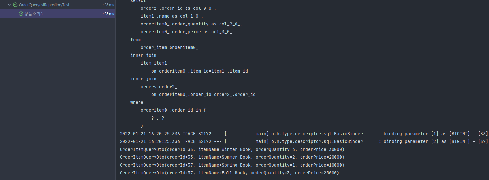

Querydsl로 일부 컬럼만 가져오기 위하여 Projections.fields를 사용하는 중에 아래와 같은 오류가 발생하여 기록하고자 합니다.

## 원인 분석
### 1. 작성 코드
OrderItemQueryDto 클래스는 아래와 같습니다.
```java
@Data
public class OrderItemQueryDto {
    @JsonIgnore
    private Long orderId;
    private String itemName;
    private int orderQuantity;  //주문수량
    private int orderPrice;     //주문가격

    public OrderItemQueryDto(Long orderId, String itemName, int orderQuantity, int orderPrice) {
        this.orderId = orderId;
        this.itemName = itemName;
        this.orderQuantity = orderQuantity;
        this.orderPrice = orderPrice;
    }
}
```

테스트 하고자 했던 메소드는 아래와 같습니다. </br>
QOrderItem의 필드는 OrderItemQueryDto의 필드명과 다르기 때문에 해당 필드에 대해서는 as 메소드를 사용하여 특정 이름을 지정해줬습니다.
```java
public List<OrderItemQueryDto> findOrderItems(List<Long> ids) {
    return jpaQueryFactory
            .select(Projections.fields(OrderItemQueryDto.class,
                    order.id.as("orderId")
                    , item.name.as("itemName")
                    , orderItem.orderQuantity
                    , orderItem.orderPrice
            ))
            .from(orderItem)
            .innerJoin(orderItem.item, item)
            .innerJoin(orderItem.order, order)
            .where(orderItem.order.id.in(ids))
            .fetch();
}
```

### 2. 테스트 코드
```java
@Test
void 상품조회() throws Exception {
    List<Long> ids = new ArrayList<>();
    ids.add(33L);
    ids.add(37L);
    List<OrderItemQueryDto> orderItems = orderQuerydslRepository.findOrderItems(ids);
    orderItems.forEach(System.out::println);
}
```

### 3. 오류 메시지
```
com.querydsl.core.types.ExpressionException: me.junsu.demojpastudy.repository.order.query.OrderItemQueryDto
at com.querydsl.core.types.QBean.newInstance(QBean.java:246)
	at com.querydsl.core.support.NumberConversions.newInstance(NumberConversions.java:86)
	at com.querydsl.jpa.FactoryExpressionTransformer.transformTuple(FactoryExpressionTransformer.java:51)
	at org.hibernate.hql.internal.HolderInstantiator.instantiate(HolderInstantiator.java:85)
	at org.hibernate.loader.hql.QueryLoader.getResultList(QueryLoader.java:474)
	at org.hibernate.loader.Loader.listIgnoreQueryCache(Loader.java:2657)
	at org.hibernate.loader.Loader.list(Loader.java:2652)
	at org.hibernate.loader.hql.QueryLoader.list(QueryLoader.java:506)
	at org.hibernate.hql.internal.ast.QueryTranslatorImpl.list(QueryTranslatorImpl.java:400)
	at org.hibernate.engine.query.spi.HQLQueryPlan.performList(HQLQueryPlan.java:219)
	at org.hibernate.internal.SessionImpl.list(SessionImpl.java:1414)
	at org.hibernate.query.internal.AbstractProducedQuery.doList(AbstractProducedQuery.java:1636)
	at org.hibernate.query.internal.AbstractProducedQuery.list(AbstractProducedQuery.java:1604)
	at org.hibernate.query.Query.getResultList(Query.java:165)
	at sun.reflect.NativeMethodAccessorImpl.invoke0(Native Method)
	at sun.reflect.NativeMethodAccessorImpl.invoke(NativeMethodAccessorImpl.java:62)
	... 중략
Caused by: java.lang.InstantiationException: me.junsu.demojpastudy.repository.order.query.OrderItemQueryDto
	at java.lang.Class.newInstance(Class.java:427)
	at com.querydsl.core.types.QBean.create(QBean.java:255)
	at com.querydsl.core.types.QBean.newInstance(QBean.java:222)
	... 98 more
Caused by: java.lang.NoSuchMethodException: me.junsu.demojpastudy.repository.order.query.OrderItemQueryDto.<init>()
	at java.lang.Class.getConstructor0(Class.java:3082)
	at java.lang.Class.newInstance(Class.java:412)
	... 100 more
```
java.lang.NoSuchMethodException 은 존재하지 않는 메소드를 사용하려고 하면 발생합니다.</br>
at java.lang.Class.getConstructor0 을 보니까 생성자 관련 문제임을 알 수 있습니다.</br>
JPA가 dto를 만들어줄 때 기본 생성자가 필요한데 파라미터 4개를 가지는 생성자를 명시적으로 선언해놔서 기본 생성자가 따로 생성되지 않아 문제가 발생한 것입니다.</br>

## 해결 방안
기본 생성자를 생성해주거나 @NoArgsConstructor 어노테이션을 추가합니다.
```java
@Data
@NoArgsConstructor
public class OrderItemQueryDto {
    @JsonIgnore
    private Long orderId;
    private String itemName;
    private int orderQuantity;  //주문수량
    private int orderPrice;     //주문가격

    public OrderItemQueryDto(Long orderId, String itemName, int orderQuantity, int orderPrice) {
        this.orderId = orderId;
        this.itemName = itemName;
        this.orderQuantity = orderQuantity;
        this.orderPrice = orderPrice;
    }
}
```
클래스 수정 후, 테스트 결과 아래와 같이 정상적으로 동작함을 확인할 수 있습니다.
